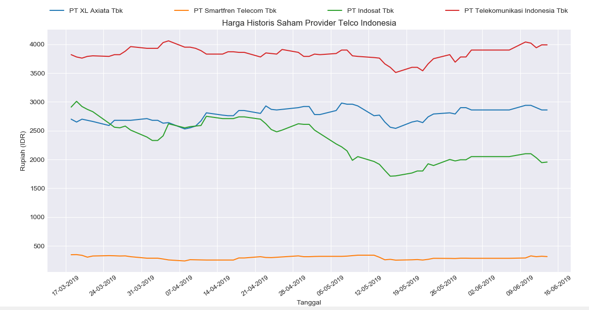
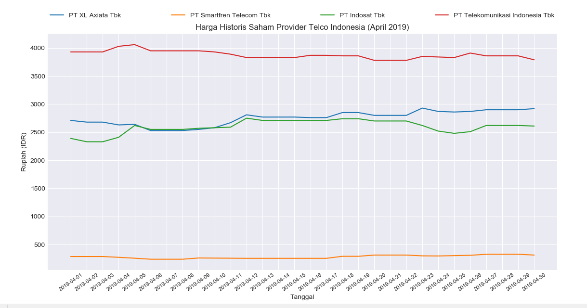

# Visualisasi data saham TELCO

Repositori ini merupakan jawaban untuk soal [ujian analytics visualtization JCDS04](https://github.com/LintangWisesa/Ujian_AnalyticsVisualization_JCDS04).

Berupa dua program python yang menghasilkan 

1. [1.py](1.py) : grafik perbandingan harga penutupan empat saham telco dalam tiga bulan terakhir.

2. [2.py](2.py) : grafik perbandingan harga penutupan empat saham telco selama bulan April 2019
